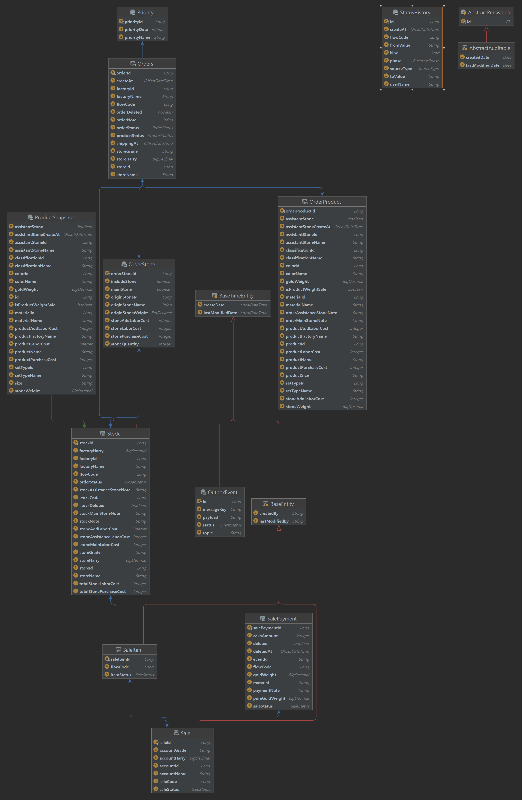

<h2>개요</h2>
<p>
프로젝트명: 상품 주문장 시스템<br>
개발 기간: 2025.07.01 ~ 진행 중<br>
개발 목적: 기존 상용 프로그램의 가격 변경에 따른 대체 솔루션 개발<br>
본 프로젝트는 귀금속 제조 및 거래 업체를 위한 통합 관리 시스템으로, 주문 관리, 재고 관리, 거래처 정산, 판매 관리 등의 기능을 제공하는 MSA 기반 애플리케이션입니다.
<h2>핵심 특징</h2>
Multi-Tenancy: 여러 조직이 데이터 격리 환경에서 독립적으로 시스템 사용<br>
Event-Driven Architecture: Kafka를 활용한 비동기 이벤트 처리<br>
Microservices: Spring Cloud 기반의 확장 가능한 마이크로서비스 구조<br>
실시간 동기화: Redis와 Kafka를 통한 실시간 데이터 동기화<br>
배치 처리: Spring Batch를 활용한 대량 데이터 처리<br>

## 🏗 아키텍처

### 시스템 아키텍처

```
                           ┌─────────────┐
                           │   Client    │
                           └──────┬──────┘
                                  │
                  ┌───────────────▼───────────────┐
                  │   API Gateway (8080)          │
                  │  - Routing                    │
                  │  - Authentication Filter      │
                  │  - Rate Limiting              │
                  └───────────────┬───────────────┘
                                  │
                  ┌───────────────▼───────────────┐
                  │ Eureka Service Discovery      │
                  │        (8761)                 │
                  └───────────────┬───────────────┘
                                  │
         ┌────────────┬───────────┼───────────┬────────────┐
         │            │           │           │            │
    ┌────▼────┐  ┌───▼────┐  ┌──▼─────┐  ┌──▼──────┐  ┌──▼──────┐
    │Auth     │  │Order   │  │Product │  │Account  │  │User     │
    │Service  │  │Service │  │Service │  │Service  │  │Service  │
    │         │  │        │  │        │  │         │  │         │
    │- JWT    │  │- Orders│  │- Stock │  │- Balance│  │- Users  │
    │- Login  │  │- Sales │  │- Items │  │- Harry  │  │- Roles  │
    └─────────┘  └────────┘  └────────┘  └─────────┘  └─────────┘
         │            │           │           │            │
         └────────────┴───────────┴───────────┴────────────┘
                                  │
                      ┌───────────▼───────────┐
                      │   Apache Kafka        │
                      │  - Event Broker       │
                      └───────────┬───────────┘
                                  │
                 ┌────────────────┼────────────────┐
                 │                │                │
         ┌───────▼──────┐  ┌─────▼──────┐  ┌─────▼──────┐
         │ PostgreSQL   │  │   Redis    │  │Config      │
         │  - Main DB   │  │  - Cache   │  │Server      │
         │              │  │  - Session │  │            │
         └──────────────┘  └────────────┘  └────────────┘
```

### 마이크로서비스 구성

| 서비스 | 포트 | 역할 |
|--------|------|------|
| **Eureka Service** | 8761 | 서비스 디스커버리 및 레지스트리 |
| **Config Server** | 8888 | 중앙 집중식 설정 관리 |
| **API Gateway** | 8080 | API 게이트웨이, 라우팅, 인증 필터 |
| **Auth Service** | 9000 | 인증/인가, JWT 토큰 발급 |
| **User Service** | 9001 | 사용자 및 권한 관리 |
| **Order Service** | 9002 | 주문 및 판매 관리 |
| **Product Service** | 9003 | 상품 및 재고 관리 |
| **Account Service** | 9004 | 거래처 및 정산 관리 |

---

### Backend

<h2>사용 언어 및 기술</h2>
<div align="center">
<p style="font-weight: bolder">사용 언어 및 프레임 워크</p>
    
    
    
    
    <br>
    
    
    

<p style="font-weight: bolder">사용 기술</p>
    
    
    
    
    

</div>

| 카테고리 | 기술 스택 |
|----------|-----------|
| **Language** | Java 17 |
| **Framework** | Spring Boot 3.4.7 |
| **MSA** | Spring Cloud (Eureka, Gateway, Config, OpenFeign, CircuitBreaker) |
| **Database** | PostgreSQL, Redis |
| **ORM** | JPA (Hibernate), QueryDSL |
| **Security** | Spring Security, JWT |
| **Messaging** | Apache Kafka |
| **Batch** | Spring Batch |
| **Migration** | Flyway |

### DevOps & Infrastructure

| 카테고리 | 기술 스택 |
|----------|-----------|
| **CI/CD** | GitHub Actions |
| **Container** | Docker |
| **Deployment** | Synology NAS, AWS EC2 |
| **Monitoring** | Spring Boot Actuator |

### Cache & Session

- **Redis**: 분산 캐싱, 세션 관리, Distributed Lock

---

## 📁 프로젝트 구조

```
multi_module/
├── api-gateway/              # API 게이트웨이
│   └── src/
│       ├── filters/          # 인증 필터, 라우팅 필터
│       └── config/           # Gateway 설정
│
├── eureka-service/           # 서비스 디스커버리
│   └── src/
│       └── config/           # Eureka 서버 설정
│
├── config-server/            # 설정 서버
│   └── src/
│       └── config/           # 중앙 설정 관리
│
├── auth-service/             # 인증 서비스
│   └── src/
│       ├── controller/       # 로그인, 토큰 발급 API
│       ├── service/          # JWT 생성/검증 로직
│       └── security/         # Security 설정
│
├── user-service/             # 사용자 서비스
│   └── src/
│       ├── domain/           # User, Role 엔티티
│       ├── repository/       # JPA Repository
│       └── service/          # 사용자 관리 로직
│
├── order-service/            # 주문/판매 서비스
│   └── src/
│       ├── domain/           # Order, Sale, StatusHistory
│       ├── event/            # Kafka 이벤트 발행
│       ├── outbox/           # Outbox Pattern 구현
│       └── batch/            # Batch Job 정의
│
├── product-service/          # 상품/재고 서비스
│   └── src/
│       ├── domain/           # Stock, Product 엔티티
│       ├── repository/       # QueryDSL 활용
│       └── service/          # 재고 관리 로직
│
├── account-service/          # 거래처/정산 서비스
│   └── src/
│       ├── domain/           # Account, Harry, Balance
│       ├── kafka/            # Kafka Consumer
│       └── service/          # 미수금 관리 로직
│
├── common/                   # 공통 모듈
│   └── src/
│       ├── dto/              # 공통 DTO
│       ├── exception/        # 공통 예외 처리
│       ├── config/           # 공통 설정
│       └── util/             # 유틸리티 클래스
│
├── .github/workflows/        # CI/CD 파이프라인
│   └── deploy.yml            # 자동 배포 스크립트
│
├── build.gradle              # Gradle 빌드 설정
├── settings.gradle           # 멀티 모듈 설정
└── README.md                 # 프로젝트 문서
```

---

## ✨ 주요 기능

### 1. 🔐 인증 및 멀티 테넌시 (Auth & Multi-Tenancy)

#### JWT 기반 인증
- Gateway의 `AuthorizationHeaderFilter`에서 토큰 유효성 검증
- 검증된 사용자 정보를 `X-User-ID`, `X-Tenant-ID` 헤더로 다운스트림 서비스 전달
- Refresh Token을 통한 토큰 갱신

#### Multi-Tenancy 지원
- `TenantContext`를 통한 테넌트 ID 분리
- `CurrentTenantIdentifierResolver`로 데이터 접근 격리
- 각 조직의 독립적인 데이터 관리 환경 제공

---

### 2. 📦 주문 및 재고 프로세스

#### 주문 생성 흐름

```
1. 주문 접수
   └─> 상점 선택
   └─> 공장 선택
   └─> 상품 옵션 선택 (보석, 재질, 색상 등)
   └─> Order 생성

2. 재고 전환
   └─> 주문 완료 시 자동으로 Stock(재고) 생성
   └─> 고유 FlowCode 부여

3. 판매 처리
   └─> 재고 상품 판매
   └─> 매출 기록
   └─> 결제 내역 생성 (현금/고금)

4. 히스토리 관리
   └─> StatusHistory 테이블에 모든 상태 변경 기록
   └─> 주문 → 재고 → 대여 → 반납 등의 전체 이력 추적
```

#### 주요 엔티티
- **Order**: 주문 정보
- **Stock**: 재고 상품
- **Sale**: 판매 내역
- **StatusHistory**: 상태 변경 이력

---

### 3. 🏭 거래처 및 정산 관리

#### 해리(Harry) 관리
- 귀금속 거래의 핵심인 **금 손실율(Harry)** 관리
- 거래처별, 등급별 차등 적용
- 실시간 해리 계산 및 정산

#### 미수금 관리
**Event-Driven 방식**으로 실시간 잔액 업데이트:

1. Order Service에서 판매 발생
2. Kafka 이벤트 발행
3. Account Service에서 이벤트 소비
4. 거래처의 **금 잔액(Gold Balance)**과 **현금 잔액(Money Balance)** 자동 갱신

**잔액 유형:**
- **Gold Balance**: 귀금속 거래 잔액
- **Money Balance**: 현금 거래 잔액

---

### 4. 🔄 데이터 동기화 및 배치

#### Event-Driven Architecture

```
Order Service
    │
    ├─> OutboxEvent 생성 (DB에 저장)
    │
    ├─> OutboxRelayService
    │   └─> Redis Queue로 전송
    │
    ├─> Kafka Producer
    │   └─> Kafka Topic으로 발행
    │
    └─> Account Service
        └─> Kafka Consumer
            └─> 미수금 갱신
```

#### Outbox Pattern
- 트랜잭션 일관성 보장
- 이벤트 발행 실패 시 재시도 메커니즘
- Redis를 활용한 임시 큐잉

#### Batch Processing
**Spring Batch** 활용:
- 대량 상품 데이터 업로드
- 초기 데이터 마이그레이션
- 정기 집계 및 리포트 생성

---

### 5. 📊 조회 및 검색

- **QueryDSL** 기반 동적 쿼리
- 상품, 주문, 거래처 다중 조건 검색
- 페이징 및 정렬 지원
- Redis 캐싱을 통한 성능 최적화

---

## 🗄 데이터베이스 설계

### ERD (Entity Relationship Diagram)



### 주요 테이블

#### User & Auth
- **users**: 사용자 정보
- **roles**: 권한 정보
- **user_roles**: 사용자-권한 매핑

#### Order & Product
- **orders**: 주문 정보
- **stocks**: 재고 상품
- **sales**: 판매 내역
- **status_history**: 상태 변경 이력

#### Account
- **accounts**: 거래처 정보
- **harry**: 해리(손실율) 설정
- **balances**: 거래처 잔액 (Gold/Money)

#### Common
- **tenants**: 테넌트(조직) 정보
- **outbox_events**: Outbox Pattern 이벤트 저장

### 테넌트 격리 전략

모든 주요 테이블에 `tenant_id` 컬럼을 포함하여 데이터 격리를 구현합니다.

```sql
-- 예시: orders 테이블
CREATE TABLE orders (
    id BIGSERIAL PRIMARY KEY,
    tenant_id BIGINT NOT NULL,
    flow_code VARCHAR(50) NOT NULL,
    -- ... 기타 컬럼
    CONSTRAINT fk_tenant FOREIGN KEY (tenant_id) REFERENCES tenants(id)
);

CREATE INDEX idx_orders_tenant ON orders(tenant_id);
```